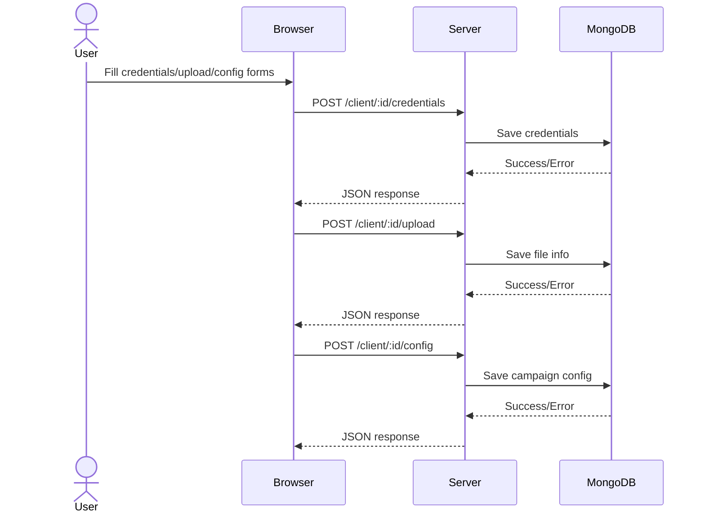
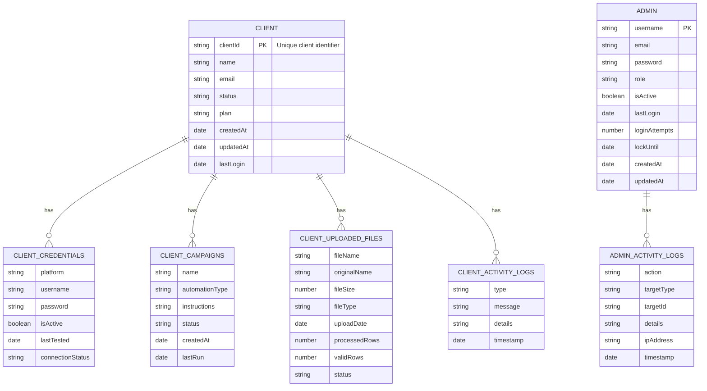
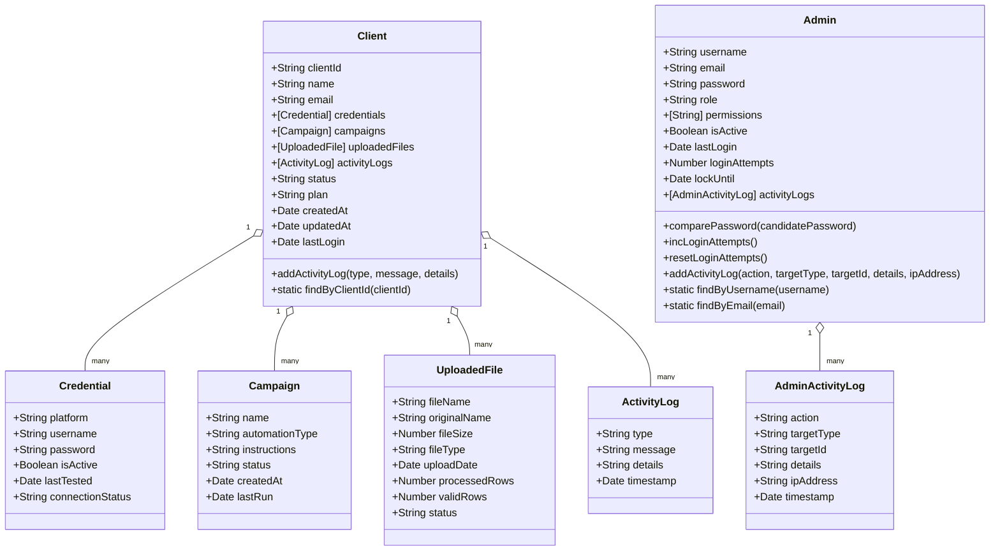

<!-- Generated by sourcery-ai[bot]: start review_guide -->

## Reviewer's Guide

This PR revamps the landing page with interactive visuals and streamlined styling, refactors the client dashboard for async API interactions, introduces full MongoDB integration via Mongoose (with Client and Admin models, connection logic, and REST endpoints), and updates project configuration and dependencies for seamless development and deployment.

#### Sequence diagram for async client dashboard API interactions

#### Entity relationship diagram for Client and Admin models in MongoDB

#### Class diagram for Client and Admin Mongoose models

### File-Level Changes

| Change | Details | Files |
| ------ | ------- | ----- |
| Enhanced landing page with interactive visuals and new sections | <ul><li>Expanded CSS custom properties, nav/hero styling, and responsive rules in style.css</li><li>Appended comprehensive styles for particles background, floating community, AI agents, workflow, terminal, and animations</li><li>Modified home.ejs to insert particles canvas, workflow steps, terminal section, community block, AI agent cards, and animation script</li><li>Created landing-page.js to drive the particle animation background</li></ul> | `public/css/style.css` `views/home.ejs` `public/js/landing-page.js` |
| Refactored client dashboard scripts and templates for async API calls | <ul><li>Removed legacy test-connection logic and CSS rules</li><li>Converted save/upload/config buttons to async/await fetch requests with input validation, loading states, and error handling</li><li>Updated client-layout.ejs and header.ejs to include new scripts and reorganized layout structure</li><li>Cleaned up client-dashboard.css and client/dashboard.ejs to reflect removed features</li></ul> | `public/js/client-dashboard.js` `views/layouts/client-layout.ejs` `views/partials/header.ejs` `views/client/dashboard.ejs` `public/css/client-dashboard.css` |
| Integrated MongoDB with Mongoose models and REST API routes | <ul><li>Implemented database.js to connect via dotenv with robust mongoose options and graceful shutdown</li><li>Added Client and Admin schemas/models with password hashing, enums, indexes, and activity log methods</li><li>Extended routes/client.js to handle client creation, credentials, file uploads, configuration, and log retrieval</li><li>Introduced initDatabase script and MongoDB setup guide documentation</li></ul> | `config/database.js` `models/Client.js` `models/Admin.js` `routes/client.js` `scripts/initDatabase.js` `MONGODB_SETUP.md` |
| Updated project configuration with new dependencies and startup scripts | <ul><li>Added mongoose, dotenv, bcryptjs, nodemon to package.json and defined dev/init-db scripts</li><li>Modified server.js to load environment variables and establish database connection on startup</li></ul> | `package.json` `server.js` |

---

Tips and commands

#### Interacting with Sourcery

- **Trigger a new review:** Comment `@sourcery-ai review` on the pull request.
- **Continue discussions:** Reply directly to Sourcery's review comments.
- **Generate a GitHub issue from a review comment:** Ask Sourcery to create an
  issue from a review comment by replying to it. You can also reply to a
  review comment with `@sourcery-ai issue` to create an issue from it.
- **Generate a pull request title:** Write `@sourcery-ai` anywhere in the pull
  request title to generate a title at any time. You can also comment
  `@sourcery-ai title` on the pull request to (re-)generate the title at any time.
- **Generate a pull request summary:** Write `@sourcery-ai summary` anywhere in
  the pull request body to generate a PR summary at any time exactly where you
  want it. You can also comment `@sourcery-ai summary` on the pull request to
  (re-)generate the summary at any time.
- **Generate reviewer's guide:** Comment `@sourcery-ai guide` on the pull
  request to (re-)generate the reviewer's guide at any time.
- **Resolve all Sourcery comments:** Comment `@sourcery-ai resolve` on the
  pull request to resolve all Sourcery comments. Useful if you've already
  addressed all the comments and don't want to see them anymore.
- **Dismiss all Sourcery reviews:** Comment `@sourcery-ai dismiss` on the pull
  request to dismiss all existing Sourcery reviews. Especially useful if you
  want to start fresh with a new review - don't forget to comment
  `@sourcery-ai review` to trigger a new review!

#### Customizing Your Experience

Access your [dashboard](https://app.sourcery.ai) to:
- Enable or disable review features such as the Sourcery-generated pull request
  summary, the reviewer's guide, and others.
- Change the review language.
- Add, remove or edit custom review instructions.
- Adjust other review settings.

#### Getting Help

- [Contact our support team](mailto:support@sourcery.ai) for questions or feedback.
- Visit our [documentation](https://docs.sourcery.ai) for detailed guides and information.
- Keep in touch with the Sourcery team by following us on [X/Twitter](https://x.com/SourceryAI), [LinkedIn](https://www.linkedin.com/company/sourcery-ai/) or [GitHub](https://github.com/sourcery-ai).

<!-- Generated by sourcery-ai[bot]: end review_guide -->
